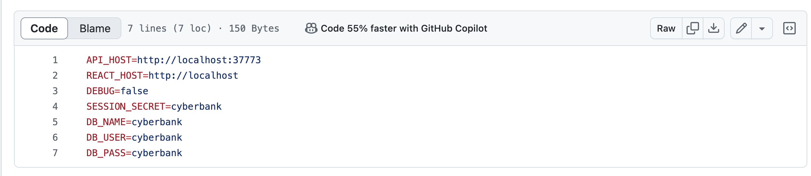
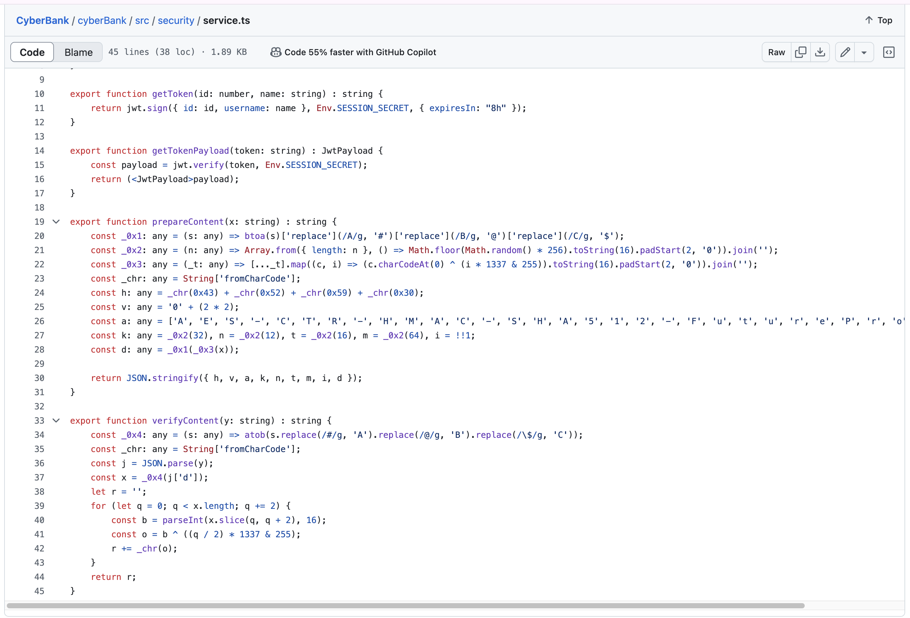
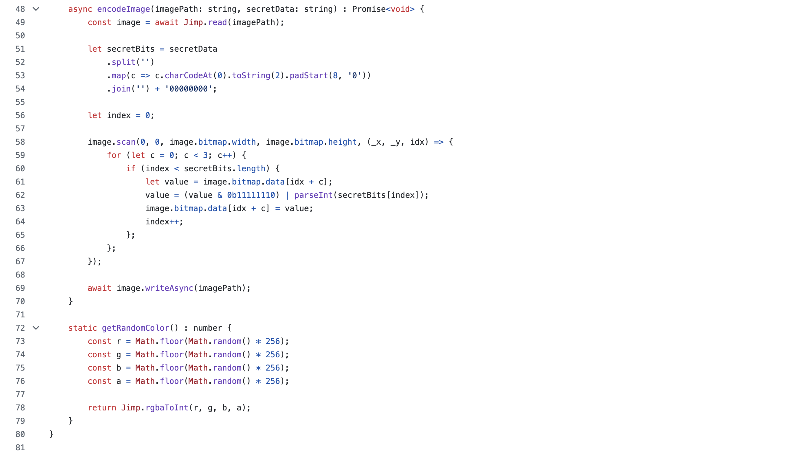
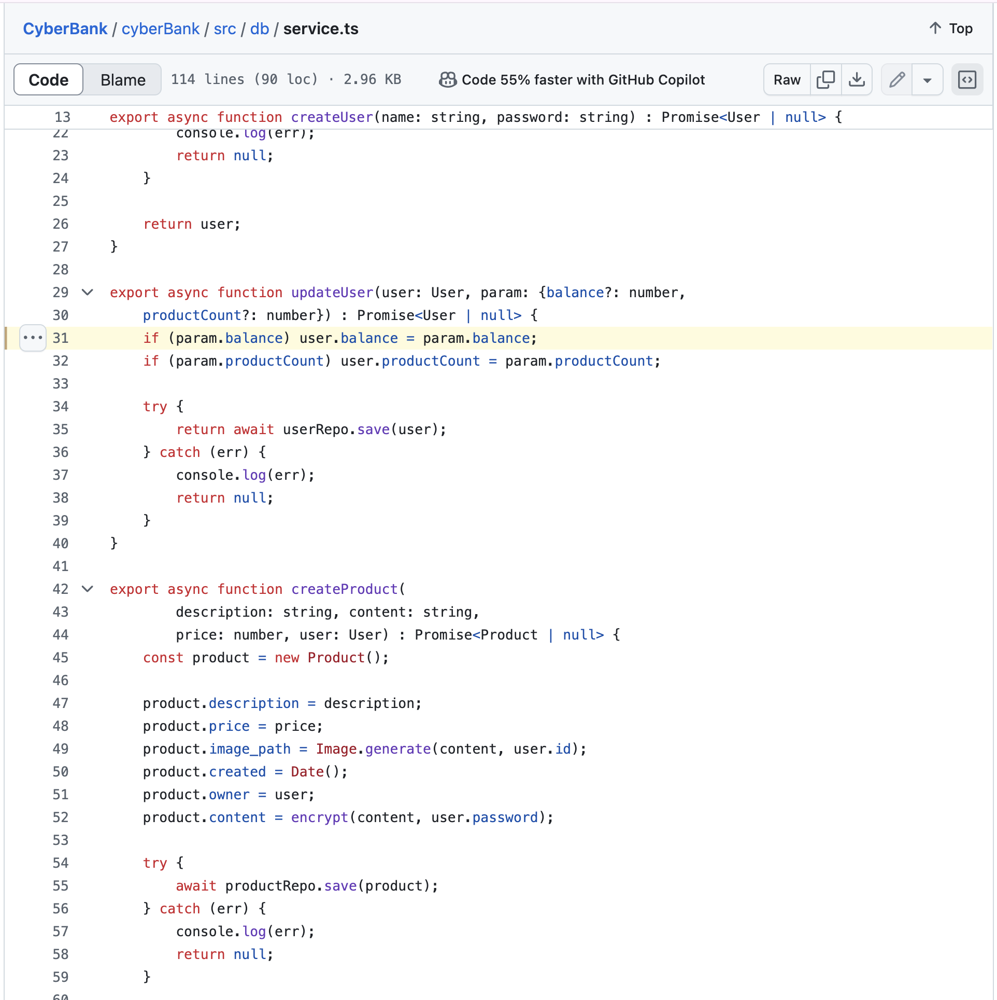
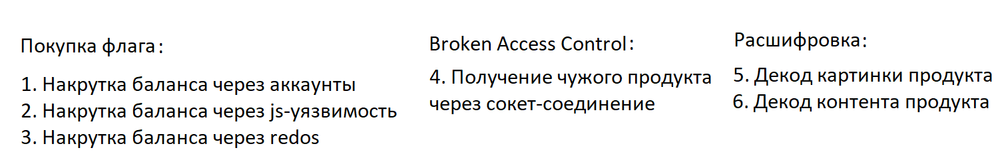

# Разбор уязвимостей сервиса SibirCTF

Всем привет!

На **SibirCTF** вам удалось порешать сервис, разработанный нашей командой.  
Сервис представлял из себя **Биржу по покупке кибервалюты**.

Изначально самым простым способом получить флаг была возможность создать несколько пользователей и, покупая продукты одного пользователя, собирать у него деньги — на которые впоследствии можно было купить флаги.

В сервисе было допущено несколько недочётов разной степени критичности:

---

### 1) Логин и пароль от базы данных в коде

В коде сервиса были оставлены логин и пароль от базы данных, которая торчит наружу:



---

### 2) Фейковая криптография и обфускация

Если внимательно прочитать код сервиса, можно заметить, что криптография, которой шифровались данные сервиса — на самом деле **и не криптография вовсе**.  
Наверное, вас должна была напугать обфускация программного кода, но на самом деле, так как это **TypeScript**, можно было легко расшифровать данные, просто перенеся код дешифратора в сплойт или исполнив его в консоли браузера:



---

### 3) Скрытый флаг внутри изображения

Следующей проблемой стал алгоритм генерации картинки — так как алгоритм прятал внутри изображения флаг, вы могли парсить картинки и извлекать из них содержимое:



---

### 4) Уязвимость с нулевым балансом

Уязвимость, которая нами изначально не задумывалась, но вот как её описал разработчик данного сервиса:
```
И если пользователь купит продукт на все бабки (то есть в функцию передастся 0 как обновлённый баланс), то он получит продукт бесплатно, потому что 0 == null -> true. Люблю.
```



---

### 5) IDOR через WebSocket

Также присутствовала уязвимость **IDOR через механизм WebSocket'ов**.

---

### 6) Цепочка уязвимостей: ReDoS → Race Condition

Самая интересная уязвимость — вы могли в коде увидеть регулярное выражение, которое должно было вас смутить и натолкнуть на мысль, что разработчики заложили в сервис **ReDoS**.  
И это правда, но на самом деле — это была **цепочка уязвимостей**:

```
ReDoS → Race Condition
```

Эксплуатируя данный недостаток, вы могли накручивать деньги на нужном вам аккаунте.

---

### Финальная карта уязвимостей

В результате у нас получилась вот такая карта недостатков в сервисе:

